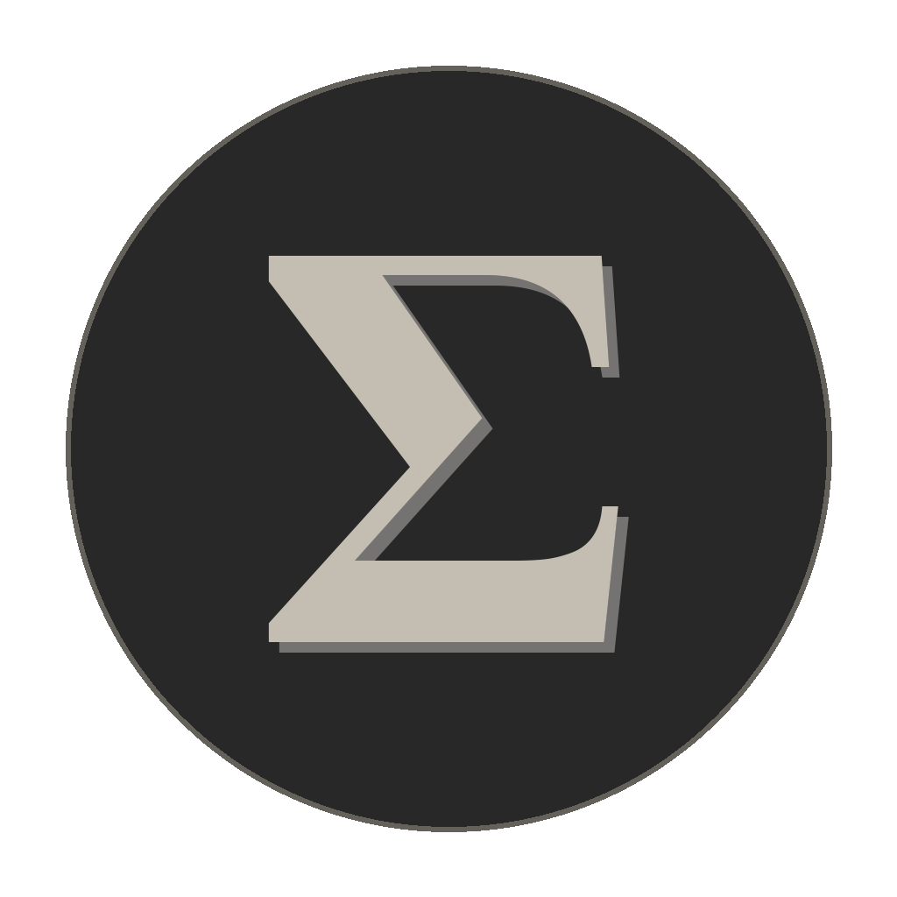

# Scriptorium, Your Ancient OCR Master

<p align="center">
  
</p>

---

스캔된 PDF 및 이미지를 완전히 검색 가능한 문서로 변환하는 데스크탑 OCR 앱입니다.  
고대 그리스어, 라틴어, 영어에 특화된 지원을 제공합니다.

A desktop OCR application for converting scanned PDFs and images into fully searchable documents, with specialized support for Ancient Greek, Latin, and English.

---

## 기능 / Features

| 기능 | Feature |
|---|---|
| 다국어 OCR | Multi-language OCR — Ancient Greek, Latin, English (동시 인식) |
| 검색 가능한 PDF | Searchable PDF — 줄 단위 invisible text layer (copy/paste/search) |
| 스마트 재시도 | Smart Confidence Retry — PSM 8/10으로 저신뢰도 단어 재처리 |
| 병렬 처리 | Parallel Processing — 최대 4스레드 동시 OCR |
| 레이아웃 감지 | Layout Intelligence — 단/복칸 자동 감지 |
| 존 편집기 | Zone Editor — 프리셋 또는 캔버스 드래그로 커스텀 OCR 존 지정 |
| 여백 설정 | Page Margins — 상/하/좌/우 여백 % 설정 |
| 이미지 전처리 | Image Enhancement — 2단계 기울기 보정, 노이즈 제거, 자동 대비 |
| 이미지 업스케일 | Image Upscaling — Lanczos 최대 4× |
| 이중 언어 분리 | Bilingual PDF Splitting — 공유 페이지 범위 지정 (Loeb 판형 지원) |
| OCR 페이지 범위 | OCR Page Range — 특정 페이지 범위만 처리 |
| 목차 감지 | Table of Contents — PDF 북마크 자동 생성 + 수동 항목 추가 |
| 페이지 번호 | Page Numbering — 로마/아라비아 숫자 인식 |
| 데이터 다운로드 | Data Download — tessdata_best + LACE/OGL 코퍼스 인앱 다운로드 |
| 자동 업데이트 | Auto-update — GitHub Releases 연동 |
| 드래그 앤 드롭 | Drag & Drop — 창 어디서나 파일 드롭 |
| 로그 패널 | Live Log Panel — 실시간 진행 상황 및 신뢰도 표시 |
| i18n | Korean / English UI — 한국어 기본, 상단 버튼으로 전환 |

---

## 기술 스택 / Technology Stack

| 레이어 | 기술 |
|---|---|
| 프론트엔드 | Electron 33, JavaScript (ES modules), HTML/CSS (클래식 회색 톤 테마) |
| 백엔드 | Python 3.10+ |
| OCR 엔진 | Tesseract (pytesseract) |
| PDF 처리 | pikepdf, pdf2image (Poppler) |
| 이미지 처리 | OpenCV, Pillow, NumPy |
| IPC | JSON-RPC 2.0 over stdin/stdout |
| 빌드 | electron-builder, PyInstaller, npm |

---

## 프로젝트 구조 / Project Structure

```
src/
  main/              Electron 메인 프로세스 (window, Python manager, IPC)
  preload/           contextBridge preload
  renderer/          UI (HTML, CSS, JS ES modules)
    components/      file-panel, options-panel, zone-editor, progress-panel, toc-panel …
python/
  core/              RPC 서버, job queue, 설정
  ocr/               Tesseract 래퍼, 레이아웃, 신뢰도 재시도, zones.py
  image/             이미지 전처리, 업스케일러
  pdf/               PDF 읽기/쓰기, TOC, 페이지 번호, 분리기
  handlers/          JSON-RPC 핸들러 (ocr, pdf, system, data)
  tests/             Python 단위 테스트 (pytest)
assets/              앱 아이콘 (icon.png, icon.ico, icon.icns)
scripts/
  install-mac.sh     macOS 의존성 + tessdata 설치
  install-linux.sh   Linux 의존성 설치
  generate-icon.py   앱 아이콘 생성 — 차콜 배경 + 실버 Σ (Pillow)
  build-icns.sh      icon.png → icon.icns 변환 (macOS)
  bundle-python.sh   PyInstaller로 Python 백엔드 번들 (scriptorium-backend)
  build-mac-app.sh   macOS .app 전체 빌드 자동화
tests/               JavaScript 테스트 (unit + e2e)
```

---

## 시작하기 / Quick Start

### 한 번에 클론 → .app 빌드 (macOS)

**처음 설치하는 경우** (저장소를 아직 클론하지 않은 경우):

```bash
git clone https://github.com/glukupikr0n/OCR-your-Greek-Latin.git && cd OCR-your-Greek-Latin && ./scripts/install-mac.sh && ./scripts/build-mac-app.sh
```

**이미 클론한 경우** (저장소 폴더가 이미 있는 경우):

```bash
cd OCR-your-Greek-Latin && git pull && ./scripts/install-mac.sh && ./scripts/build-mac-app.sh
```

> 완료 후 `.app`이 `/Applications`에 자동으로 설치됩니다.

### 개발 모드 실행 / Dev mode

```bash
git clone https://github.com/glukupikr0n/OCR-your-Greek-Latin.git && cd OCR-your-Greek-Latin && ./scripts/install-mac.sh && npm start
```

이미 클론한 경우:

```bash
cd OCR-your-Greek-Latin && npm start
```

> `install-mac.sh` 한 번 실행으로 Homebrew · Tesseract · Poppler · Python 가상환경 · npm 패키지 · 언어팩(`grc`, `lat`) 설치가 모두 완료됩니다.

<details>
<summary>수동 설치 / Manual setup</summary>

```bash
# Python 가상환경
python3.11 -m venv python/.venv
source python/.venv/bin/activate
pip install -r python/requirements.txt
deactivate

# npm
npm install
```

</details>

---

## 빌드 / Build

### 독에서 실행 가능한 .app / Dock-ready .app

Python venv 없이 독립 실행되는 `.app` 번들을 만들려면 `build-mac-app.sh`를 사용하세요.  
내부적으로 PyInstaller로 Python 백엔드를 단일 바이너리(`scriptorium-backend`)로 번들한 뒤 Electron과 함께 패키징합니다.

To build a fully self-contained `.app` (no Python venv required at runtime):

```bash
./scripts/build-mac-app.sh
# 내부 순서: build-icns.sh → bundle-python.sh (PyInstaller) → npm run build:mac:app
```

단계별 수동 실행 / Step by step:

```bash
./scripts/build-icns.sh         # icon.png → icon.icns
./scripts/bundle-python.sh      # Python 백엔드 → dist-python/scriptorium-backend
npm run build:mac:app           # Electron .app → dist/mac/
```

### 기타 빌드 명령어 / Other build commands

```bash
npm run build:mac        # macOS DMG + .app (x64 + arm64)
npm run build:linux      # Linux AppImage + deb
npm run build:win        # Windows NSIS installer
```

| 명령어 | 출력물 | 경로 |
|---|---|---|
| `build:mac:app` | `OCR Your Greek Latin.app` | `dist/mac/` |
| `build:mac` | `.app` + `.dmg` | `dist/mac/`, `dist/` |
| `build:linux` | `.AppImage`, `.deb` | `dist/` |
| `build:win` | `.exe` (NSIS) | `dist/` |

---

## UI 기능 / UI Features

| 기능 | 설명 |
|---|---|
| 언어 전환 | 오른쪽 상단 **EN / 한국어** 버튼으로 즉시 전환 (기본: 한국어) |
| 드래그 앤 드롭 | 앱 창 어디서나 PDF/이미지 파일 드롭 |
| 서브 설정 | 각 체크박스 클릭 시 하위 세부 설정 표시 (기울기 각도, 노이즈 강도 등) |
| 존 편집기 | 캔버스 위 드래그로 존 그리기 · 이동 · 크기 조절 · 삭제 |
| 실시간 로그 | 오른쪽 패널에 페이지별 진행률과 신뢰도 실시간 표시 |
| 자동 업데이트 | 새 버전 발견 시 상단 배너 표시 → 다운로드/재시작 |
| 수동 목차 | 처리 전 TOC 항목(제목, 페이지, 레벨) 직접 추가 |

---

## 존 편집기 / Zone Editor

OCR을 특정 영역에만 적용하고 싶을 때 사용합니다.  
**"커스텀 존 편집"** 체크박스를 켜면 미리보기 캔버스 위에서 드래그하여 영역을 직접 그릴 수 있습니다.

**프리셋 / Presets:**

| 프리셋 | 설명 |
|---|---|
| 자동 (기본) | 레이아웃 자동 감지 |
| 전체 페이지 | 전체 영역 |
| 본문만 | 상/하/좌/우 여백 제외 |
| 왼쪽 여백 | 왼쪽 여백만 |
| 오른쪽 여백 | 오른쪽 여백만 |
| 양쪽 여백 | 양쪽 여백 동시 |
| 블록 자동 감지 | Tesseract 블록 레벨 자동 감지 |

각 존마다 별도 PSM 및 언어 설정 가능.

---

## 데이터 다운로드 / Data Download

앱 하단 **데이터 다운로드…** 버튼으로 인앱 다운로드 다이얼로그를 열 수 있습니다.

- **Tesseract 언어 데이터** — [tessdata_best](https://github.com/tesseract-ocr/tessdata_best)에서 `grc` / `lat` / `eng` traineddata 다운로드
- **LACE Greek OCR Corrections** — LATTICE 프로젝트의 검증된 그리스어 OCR 교정 데이터
- **OpenGreekAndLatin TEI corpus** — First 1K Years of Greek 프로젝트의 TEI XML 코퍼스 (참고용)

설치 스크립트도 `grc.traineddata`, `lat.traineddata`를 [tessdata_best](https://github.com/tesseract-ocr/tessdata_best)에서 자동으로 다운로드합니다.

---

## 테스트 / Testing

```bash
# Python 단위 테스트 / Python unit tests
cd python && pytest tests/ -v

# JavaScript 단위 테스트 / JavaScript unit tests
npm test

# E2E 테스트 / End-to-end tests
npm run test:e2e
```

---

## 라이선스 / License

MIT
